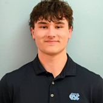

---
# ============================================================
# ABOUT ME PAGE (aboutme.qmd)
# This is a Quarto Markdown file. You can mix regular text,
# HTML, and special Quarto features on the same page.
# The section between the --- lines is called the "front matter"
# and controls page-level settings.
# ============================================================

title: "About Me"   # ✏️ This becomes the page title shown in the browser tab
---

<!-- ============================================================
  PROFILE PHOTO
  - Replace "headshot.jpg" with your actual image filename
  - Make sure the image file is saved in the same folder as this .qmd file
  - width/height control the display size (both set to 400px = square crop)
  - object-position: "50% 32%" shifts the crop upward to better frame a face
    → try "50% 50%" for dead center, or "50% 20%" to crop even higher
  - border: adds a solid dark border around the photo
  ============================================================ -->

<!-- ============================================================
  BIO / INTRODUCTION
  ✏️ Replace the placeholder below with 2–4 sentences about yourself.
  Example:
    Hi! I'm Jane Smith, a second-year Computer Science student at UNC Chapel Hill.
    I'm passionate about data visualization and building tools that make
    information more accessible. Outside of class, I love hiking and photography.
  ============================================================ -->

I’m Seth Hall, a student at UNC Chapel Hill with strong interests in statistics, data science, and public health. I’m especially interested in using quantitative methods to better understand real-world problems and create work that is practical, meaningful, and grounded in impact. My academic and project experience has helped me build skills in statistical modeling, data analysis, machine learning, and programming, while also strengthening my ability to communicate technical ideas clearly.

A major part of what drives me is the opportunity to apply those skills in areas connected to health, education, and community impact. I’m drawn to work that uses data not just to generate results, but to support better decisions, improve access, and address problems that affect people in tangible ways.

Outside of that broader mission-driven work, I also have a personal interest in sports analytics. I enjoy exploring how data can be used to understand player and team performance, evaluate strategy, and make predictions in competitive settings. Through basketball-related projects, I’ve worked with data connected to NBA game outcomes and variables such as point spread, total points, and offensive rebounds. For me, sports analytics is an exciting way to keep building my technical skills while applying them to something I genuinely enjoy.

<!-- ============================================================
  RESUME LINK
  - "Example Resume" is the clickable link text — ✏️ change to "My Resume" or similar
  - example_resume.pdf is the filename — ✏️ rename to match your actual file
  - Make sure your PDF is saved in the same folder as this .qmd file
  ============================================================ -->

[Resume](Seth_Hall_Resume.pdf)

<!-- ============================================================
  LINK TO PROJECTS PAGE
  - proj.qmd refers to your other page — leave this as-is unless you renamed that file
  ============================================================ -->

To view more information about my projects, please visit the [Projects](proj.qmd) tab.

<!-- ============================================================
  CONTACT INFORMATION
  ✏️ Replace every placeholder in angle brackets <> with your real info

  EMAIL:
    - Replace <youremail> with your email address (appears twice — once as
      display text, once as the mailto: link)

  LINKEDIN:
    - Replace <yourname> with how you want your name to appear as link text
    - Replace <copy link to linkedin> with your full LinkedIn URL
      Example: https://www.linkedin.com/in/janesmith
  ============================================================ -->

**Contact Information:**

-   Personal email: [hall.seth.b\@gmail.com](mailto:hall.seth.b@gmail.com)
-   University email: [sefbh\@ad.unc.edu](mailto:sefbh@ad.unc.edu)
-   GitHub: [sefbh](https://github.com/sefbh)
-   LinkedIn: [Seth Hall](https://www.linkedin.com/in/seth-hall-855001364/?skipRedirect=true)
